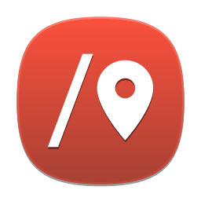

# MahoMaps v1



Yandex.Maps client for MIDP2-capable devices.

## Features

- Geolocation detection
- Map caching
- Search
- Organization cards
- Building a route

## System requirements

- CLDC 1.1
- MIDP 2.0
- JSR-75
- A lot of RAM
- **A lot** of space in persistent memory
- JSR-179 (optional)
- HTTPS support (optional)

### Recommended system tweaks

On symbian 9.x, it's recommended to install a patch to allow access to file system without confirmation popups.

### How to make geolocation work?

- On Symbian 9.x / ^3 disable **all location sources except unassisted GPS**.
- **Disable A-GPS**. On non-symbian devices it may be called as "geolocation server", "internet support", "supplement server" or something like that.
- Let your device perform a cold start: request geolocation in any app (MahoMaps, Google Maps, Ovi Maps, Sports tracker, anything else) and keep the device under clear sky. It is desirable that the horizon is visible. Wait until it catches sattelites. May take a while.
- Once you are sure that GPS receiver works okay, you may try to enable A-GPS to increase accuracy and startup time. We recommend using `supl.google.com` as supplement server. `supl.nokia.com` is dead!
- If you experience issues, try disabling A-GPS.
- If you device can't catch sattelites even in good weather, check that its GPS receiver is operable.

## Tested systems

- Symbian ^3/Anna/Belle/Refresh/FP1/FP2
- Symbian 9.2-9.4
- Bada 1.1

## Supported emulators

- [KEmulator nnmod](https://nnp.nnchan.ru/kem/)
- [J2ME Loader](https://github.com/nikita36078/J2ME-Loader)

## Build without IDE

### Github actions

We have an action which builds the app on git pushes. You can pull latest builds from it, check "checks" section of your pull request or commit info.

### Windows

Install an SDK for your device, follow its instructions.

### Debian / Ubuntu

```
dpkg --add-architecture i386
apt update
apt-get install gcc-multilib libxt6:i386
```
Then install 32-bit JDK 1.6.0 and [WTK 2.5.2](https://www.oracle.com/java/technologies/java-archive-downloads-javame-downloads.html). Edit [build script](build.sh) to use your installed tools (instead of "compiler" repo clone) and run it.

## Contact us

[Telegram chat](https://t.me/nnmidletschat)

## Adding your own localisation

- Create copy of `en.txt`/`ru.txt`, name it with your language's code and translate all strings.
- Keep in mind that original language of app was russian (russian is original. Not english).
- You can test how it will look like with replacing english file, for example.
- To make it actually work as one more language, you need to make 3 changes in app's code:

1. Go to `Settings.java`. In `GetUiLangFile()` add one more case (with next number) to the switch. Make it return name of your file without `.txt`.
2. Startup selection: `MahoMapsApp.java`, `processFirstLaunch()`. Add your language to `lang` choice group. Name it in english (`Russian`, not `Русский`).
3. Settings menu: `SettingsScreen.java`, `ChoiceGroup uiLang`. Add your language. Name it as is (`Русский`, not `Russian`).

CI on your pull request will attempt to compile the project. If you failed somewhere, it will show that.
